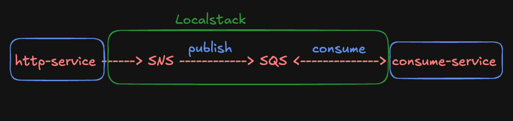

# go-localstack-demo


#### Prerequisite

- aws-cli

1. Download aws-cli

```bash
curl "https://awscli.amazonaws.com/AWSCLIV2.pkg" -o "AWSCLIV2.pkg"
```

2. Install aws-cli

```bash
sudo installer -pkg AWSCLIV2.pkg -target /
```

3. Verify

```bash
aws --version
```

Or using install via homebrew

```bash
brew install awscli
```

#### Configuration aws credential for local

```bash
aws configure
```

###### *credential for local testing*

```plaintext
AWS Access Key ID [None]: test
AWS Secret Access Key [None]: test
Default region name [None]: ap-southeast-1
Default output format [None]: json
```

#### How to run project ?

Run all service in container
```bash
make up
```

Shutdown all service in container
```bash
make down
```

Verify localstack sync policy (sqs + sns)
```bash
make logs-localstack
```

Run http service for sns publishing message
```bash
make run-http-service
```

Run consume service for sqs receiving message
```bash
make run-consume-service
```

Clean docker system
```bash
make clean
```

##### *Request sending message*
```bash
curl "http://localhost:7777/publish?message=hello%20from%20sns
```

##### S3 Request & Sync

Upload file to s3
```bash
make upload-s3
```
Sync files from s3 to local directory `/s3-upload`
```bash
make sync-s3
```